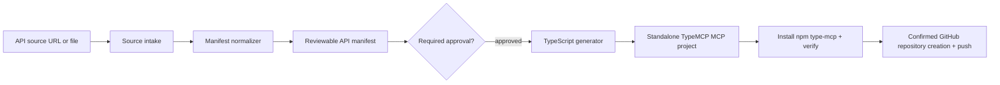

# Architecture overview

**Status:** Approved design; implementation pending.

## Components

### Source intake

The intake layer accepts structured OpenAPI/Swagger JSON/YAML, a Swagger UI URL, or supplied Markdown/HTML documentation. It fetches remote content with bounded size/time, records URL/content hash/content type, and parses all external content as `unknown`.

Swagger UI discovery only follows evidence in the supplied page/configuration and well-known linked spec references. It does not crawl unrelated pages.

### Normalized manifest

Every source becomes the same manifest model. A normalized operation has a stable ID, method, path/base URL, input/output schema evidence, auth requirements, source citations, confidence, and runtime execution policy.

Structured specifications can progress directly to generation after review. Document-derived operation candidates require an explicit manifest approval gate.

### Generator

The generator renders a normal TypeScript repository. Its `package.json` adds an explicit pinned/verified `type-mcp` npm dependency; it does not copy library code. Generated source isolates API fetch/auth injection, tool declarations, schema validation, and runtime policy.

### Runtime policy

Generation does not omit approved endpoints. The generated policy layer controls execution by operation ID and HTTP method. Mutating operations are protected by default; configuration can permit them deliberately. The policy decision occurs before the upstream request is issued.

### Publication boundary

GitHub creation/push is outside source generation. It occurs only after project verification and a final confirmation of owner, repository name, and visibility.

## Invariants

1. Manifest source evidence and hashes contain no credentials.
2. Generated source contains environment variable names but never their values.
3. Each tool’s upstream request is constructed only from validated MCP input plus approved auth mapping.
4. Upstream failures are redacted into safe MCP errors.
5. Generated project verification proves the installed npm package, not an adjacent checkout, is used.
