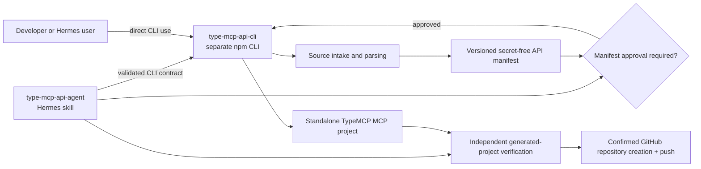

# Architecture overview

**Status:** Approved design; implementation pending.

## Product split

## Responsibilities

### `type-mcp-api-cli` (separate repository)

The CLI owns deterministic behavior that must work without Hermes:

- bounded remote/local source intake
- OpenAPI/Swagger parsing, Swagger UI spec discovery, and Markdown/HTML evidence extraction
- manifest normalization, schema validation, diagnostics, content hashes, and versioning
- TypeScript template rendering and generation metadata
- CLI unit/integration/E2E tests

It accepts untrusted input as `unknown`, validates it, and emits secret-free machine-readable artifacts. It does not create GitHub repositories or retain credentials.

### `type-mcp-api-agent` (this repository)

The skill owns conversational and side-effect boundaries:

- select and verify a CLI executable/version against the manifest contract
- call inspect/manifest/generate stages and surface safe diagnostics
- obtain explicit manifest approval for document-derived candidates
- enforce final GitHub publication confirmation
- independently verify generated output, including npm-installed `type-mcp`
- test its orchestration with a controlled fixture CLI

The skill may not parse API definitions or render source itself. If the CLI lacks a needed capability, update the CLI contract/repository rather than growing a duplicate implementation here.

## CLI compatibility contract

The skill requires these values from a CLI only after trusted resolution defined in `docs/guides/cli-compatibility.md`:

| Value | Purpose |
| --- | --- |
| exact CLI package/version + npm integrity | Artifact provenance and allowed command selection |
| resolved absolute bin path | Prevent `PATH` substitution and path escape |
| manifest schema version | Compatibility gate before review/generation |
| generation protocol version | Stable request/output compatibility between skill and CLI |
| sanitized source provenance | Safe origin/path identifier, retrieval time, content hash |
| secret-free diagnostics | Safe errors/warnings for user review |

No CLI release is currently supported. When a release is enabled, the skill fails closed when package integrity, absolute binary location, metadata protocol/schema, or policy version is absent or unsupported. It records only approved names/versions/integrities/sanitized hashes, never credentials or raw private specifications, in task artifacts.

## Data flow

1. User provides a source URL/file and optionally an explicit CLI version/path.
2. Skill resolves a compatible CLI executable from an approved source.
3. CLI retrieves/parses bounded input and records secret-free provenance.
4. CLI normalizes operations into the manifest contract, validates its closed schema, and emits an RFC 8785/JCS canonical digest plus a challenge when document-derived.
5. Skill recomputes/displays the digest and, after explicit user confirmation, invokes CLI `approve` to obtain a receipt bound to that challenge.
6. CLI validates the separate receipt (MAC, challenge, expiry, digest, manifest/protocol versions), then renders a standalone TypeScript MCP project with `type-mcp` from npm.
7. Skill runs generated-project lint/typecheck/test/build and an official-transport smoke test.
8. Only after a final recorded publication confirmation of owner/org, name, visibility, and source branch does the skill create and push the output repository.

## Runtime policy and publication boundaries

Generation does not omit approved endpoints. Generated policy controls execution by operation ID and HTTP method; mutating operations are protected by default. The policy decision occurs before any upstream request.

GitHub creation/push is outside CLI behavior and only runs in the skill after final recorded confirmation of GitHub owner/organization, repository name, visibility, **and source branch**. The skill must verify the checked-out/ref-to-publish branch exactly matches that recorded branch before staging or pushing.

## Approval and policy invariants

- A document-derived manifest is generation-eligible only with a CLI-issued, unexpired, single-use MAC receipt bound to its current RFC 8785/JCS canonical digest, manifest version, and CLI protocol version.
- `GET`, `HEAD`, and `OPTIONS` derive `read`; `POST`, `PUT`, `PATCH`, and `DELETE` derive `protected-write`; unknown methods derive `deny`. `TYPE_MCP_ALLOW_PROTECTED_OPERATIONS` grants protected writes only by exact operation ID.
- An override is a user-visible, reasoned manifest edit, never a parser inference, and policy is evaluated before upstream URL/header/body/auth construction or dispatch.
- Publication requires an explicit recorded owner/org, name, visibility, and source-branch confirmation; the branch must be rechecked immediately before push.

## Invariants

1. Manifest source evidence and hashes contain no credentials.
2. Generated source contains environment variable names but never their values.
3. The skill never silently replaces an incompatible/missing CLI.
4. Each tool’s upstream request is constructed only from validated MCP input plus approved auth mapping.
5. Upstream failures are redacted into safe MCP errors.
6. Generated-project verification proves the installed npm `type-mcp` package, not an adjacent checkout, is used.
