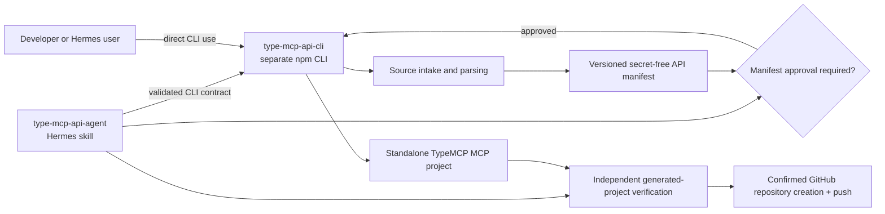

# Architecture overview

**Status:** Approved design; implementation pending.

## Product split

## Responsibilities

### `type-mcp-api-cli` (separate repository)

The CLI owns deterministic behavior that must work without Hermes:

- bounded remote/local source intake
- OpenAPI/Swagger parsing, Swagger UI spec discovery, and Markdown/HTML evidence extraction
- manifest normalization, schema validation, diagnostics, content hashes, and versioning
- TypeScript template rendering and generation metadata
- CLI unit/integration/E2E tests

It accepts untrusted input as `unknown`, validates it, and emits secret-free machine-readable artifacts. It does not create GitHub repositories or retain credentials.

### `type-mcp-api-agent` (this repository)

The skill owns conversational and side-effect boundaries:

- select and verify a CLI executable/version against the manifest contract
- call inspect/manifest/generate stages and surface safe diagnostics
- obtain explicit manifest approval for document-derived candidates
- enforce final GitHub publication confirmation
- independently verify generated output, including npm-installed `type-mcp`
- test its orchestration with a controlled fixture CLI

The skill may not parse API definitions or render source itself. If the CLI lacks a needed capability, update the CLI contract/repository rather than growing a duplicate implementation here.

## CLI compatibility contract

The skill requires these values from the CLI before generation:

| Value | Purpose |
| --- | --- |
| CLI package/name and semantic version | Provenance and supported command selection |
| manifest schema version | Compatibility gate before review/generation |
| generation protocol version | Stable request/output compatibility between skill and CLI |
| source provenance | URL/path identifier, media type, retrieval time, content hash |
| secret-free diagnostics | Safe errors/warnings for user review |

The skill fails closed when a required version is absent or unsupported. It records only names/versions/hashes, never credentials or raw private specifications, in its task artifacts.

## Data flow

1. User provides a source URL/file and optionally an explicit CLI version/path.
2. Skill resolves a compatible CLI executable from an approved source.
3. CLI retrieves/parses bounded input and records secret-free provenance.
4. CLI normalizes operations into the manifest contract.
5. Skill displays the manifest and requires explicit approval for document-derived candidates.
6. CLI renders a standalone TypeScript MCP project with `type-mcp` from npm.
7. Skill runs generated-project lint/typecheck/test/build and an official-transport smoke test.
8. Only after a final publication confirmation does the skill create and push the output repository.

## Runtime policy and publication boundaries

Generation does not omit approved endpoints. Generated policy controls execution by operation ID and HTTP method; mutating operations are protected by default. The policy decision occurs before any upstream request.

GitHub creation/push is outside CLI behavior and only runs in the skill after final confirmation of owner, repository name, and visibility.

## Invariants

1. Manifest source evidence and hashes contain no credentials.
2. Generated source contains environment variable names but never their values.
3. The skill never silently replaces an incompatible/missing CLI.
4. Each tool’s upstream request is constructed only from validated MCP input plus approved auth mapping.
5. Upstream failures are redacted into safe MCP errors.
6. Generated-project verification proves the installed npm `type-mcp` package, not an adjacent checkout, is used.
