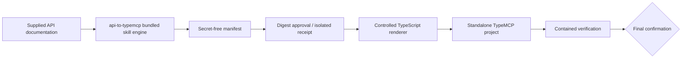

# Architecture overview

**Status:** Executable bundled-engine contract implemented; release publication is separate.

## Skill boundary

The released `skills/api-to-typemcp/` artifact is the generator delivery unit. Its **bundled skill engine** owns deterministic parsing, normalization, receipt state, policy, rendering, and static verification; it is not a separately released executable. Generated projects use the published `@theorvane/type-mcp` npm package, never a copied implementation or adjacent checkout.

## Implemented layout

`skills/api-to-typemcp/` now contains the shipping engine modules, templates, runtime reference, tests, and contained generated-project E2E verification. Future work may add separately reviewed transport/release capabilities, but active documentation must not describe the implemented bundled engine as staged.

## Responsibilities

### Bundled engine

- accept only bounded, supplied sources;
- normalize source evidence, operations, policy, and secret-free manifest data;
- hold approval receipts in isolated state and validate exact digest, integrity, expiry, and single use;
- render only into a confirmed empty target or an explicit contained replacement target;
- verify generated projects in a fresh scrubbed workspace.

### Generated project

- declare exact published `@theorvane/type-mcp` dependency rather than `file:`, `git:`, local, or copied source;
- expose every approved operation as a tool;
- evaluate protected-write and deny policy before URL, query, headers, body, or authentication is constructed;
- return safe errors without credentials, stacks, raw private URLs, or upstream bodies.

## Approval, policy, and publication invariants

- A manifest is eligible only with an **engine-issued, unexpired, single-use HMAC-validated receipt** bound to the current deterministic `sha256:` digest. The digest encoding is engine-specific, not RFC 8785/JCS, and the receipt carries no manifest-contract version.
- `TYPE_MCP_ALLOW_PROTECTED_OPERATIONS` grants protected writes only by exact known operation ID. A parser, operation name, or prose cannot classify a mutating method as `read`.
- Bounded source intake never crawls a bare base origin.
- Verification first inspects generated `package.json` and `package-lock.json`, runs isolated `npm ci --ignore-scripts` with lifecycle scripts and inherited proxies disabled, then performs only contained checks with a local fixture upstream. A host container/VM/sandbox remains required when the dependency graph is untrusted.
- Publication requires a recorded owner/org, name, visibility, and source-branch confirmation. The actual checked-out/ref-to-publish branch must exactly equal that recorded branch immediately before staging, committing, or pushing.

## Invariants

1. The bundled skill engine is the sole generator implementation and release boundary.
2. Manifest evidence and hashes contain no credentials.
3. Generated source contains environment variable names but never values.
4. Protected-write authorization is checked before request construction.
5. Generated-project verification proves use of published `@theorvane/type-mcp`.
