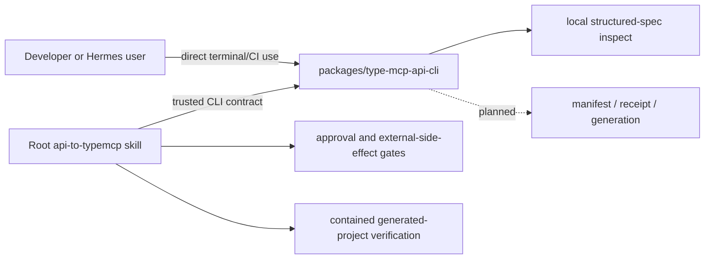

# Architecture overview

**Status:** Unified workspace bootstrap. Root skill/orchestration contract and the local CLI package are present; only the CLI package's `metadata` and local structured-spec `inspect` stage are implemented.

## Workspace boundary

## Responsibilities

### `packages/type-mcp-api-cli/`

The CLI is an independently versioned, installable package inside this repository. It owns deterministic behavior that must work without Hermes:

- local/bounded source intake and parsing;
- manifest normalization, schema validation, diagnostics, content hashes, and versioning;
- TypeScript template rendering and generation metadata;
- CLI unit/integration/E2E tests and its package lock.

Currently it implements `metadata --json`, closed schema publication, and local OpenAPI 3.x / Swagger 2.0 JSON/YAML inspection. It accepts untrusted input as `unknown`, validates it, and emits secret-free machine-readable artifacts. It does not create GitHub repositories or retain credentials.

### Root skill/orchestration

The root `api-to-typemcp` skill owns conversational and external-side-effect boundaries:

- select and verify a CLI executable/version against the compatibility contract;
- surface safe inspect/manifest/generate diagnostics;
- obtain explicit manifest approval for document-derived candidates;
- enforce final GitHub publication confirmation;
- independently verify generated output, including npm-installed `type-mcp`.

The skill may not parse API definitions or render source itself. If the CLI lacks a capability, implement it under `packages/type-mcp-api-cli/`, not in root skill code.

## CLI compatibility contract

The skill uses `docs/guides/cli-compatibility.md` as the canonical policy for an executable package release. The in-repository package is **not** automatically trusted for user-facing generation: no npm release is currently supported, and production invocation remains fail-closed until an exact package/version/integrity/protocol/schema entry is reviewed into that policy.

The policy requires exact package/version/integrity, a resolved absolute bin path, manifest schema/protocol compatibility, sanitized provenance, and secret-free diagnostics. Metadata is compatibility evidence only after artifact provenance is established.

## Runtime policy and publication boundaries

Generation does not omit approved endpoints. Generated policy controls execution by operation ID and HTTP method; mutating operations are protected by default and policy is evaluated before any upstream request construction.

GitHub output creation/push is outside CLI behavior and only runs in the skill after final recorded confirmation of owner/org, name, visibility, and **source branch**. The checked-out/ref-to-publish branch must exactly match that recorded branch before staging, committing, or pushing.

## Approval and runtime invariants

- A document-derived manifest is generation-eligible only with a **CLI-issued, unexpired, single-use MAC receipt** bound to the current RFC 8785/JCS canonical digest, manifest version, and CLI protocol version.
- `TYPE_MCP_ALLOW_PROTECTED_OPERATIONS` grants protected writes only by exact operation ID; unknown methods deny. A source parser, operation name, or documentation prose cannot classify a mutating method as `read`.
- Publication requires an explicit recorded **owner/org, name, visibility, and source-branch confirmation**; the branch must be rechecked immediately before push.

## Invariants

1. CLI package logic is never reimplemented in root skill code.
2. Manifest source evidence and hashes contain no credentials.
3. Generated source contains environment variable names but never their values.
4. The skill never silently replaces an incompatible/missing CLI.
5. Generated-project verification proves the installed npm `type-mcp` package, not an adjacent checkout, is used.
