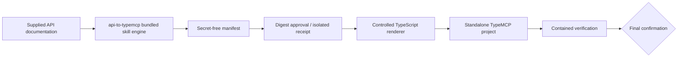

# Architecture overview

**Status:** Embedded-engine migration boundary established; executable engine implementation is staged.

## Skill boundary

The released `skills/api-to-typemcp/` artifact is the generator delivery unit. Its **bundled skill engine** owns deterministic parsing, normalization, receipt state, policy, rendering, and static verification; it is not a separately released executable. Generated projects use the published `@theorvane/type-mcp` npm package, never a copied implementation or adjacent checkout.

## Staged layout

Task 1 establishes `scripts/` and `templates/` as structural release paths only. Task 2 will add structured-source engine modules and tests; Task 4 will add controlled TypeScript templates; Task 5 will add generated-project E2E verification. Until then, no active documentation may claim the engine can generate a project.

## Responsibilities

### Bundled engine

- accept only bounded, supplied sources;
- normalize source evidence, operations, policy, and secret-free manifest data;
- hold approval receipts in isolated state and validate exact digest, integrity, expiry, and single use;
- render only into a confirmed empty target or an explicit contained replacement target;
- verify generated projects in a fresh scrubbed workspace.

### Generated project

- declare exact published `@theorvane/type-mcp` dependency rather than `file:`, `git:`, local, or copied source;
- expose every approved operation as a tool;
- evaluate protected-write and deny policy before URL, query, headers, body, or authentication is constructed;
- return safe errors without credentials, stacks, raw private URLs, or upstream bodies.

## Approval, policy, and publication invariants

- A document-derived manifest is eligible only with an **engine-issued, unexpired, single-use integrity-validated receipt** bound to the current RFC 8785/JCS canonical digest and manifest contract version.
- `TYPE_MCP_ALLOW_PROTECTED_OPERATIONS` grants protected writes only by exact known operation ID. A parser, operation name, or prose cannot classify a mutating method as `read`.
- Bounded source intake never crawls a bare base origin.
- Verification first inspects generated metadata and lockfile, runs `npm ci --ignore-scripts`, then performs only contained checks with a local fixture upstream.
- Publication requires a recorded owner/org, name, visibility, and source-branch confirmation. The actual checked-out/ref-to-publish branch must exactly equal that recorded branch immediately before staging, committing, or pushing.

## Invariants

1. The bundled skill engine is the sole generator implementation and release boundary.
2. Manifest evidence and hashes contain no credentials.
3. Generated source contains environment variable names but never values.
4. Protected-write authorization is checked before request construction.
5. Generated-project verification proves use of published `@theorvane/type-mcp`.
