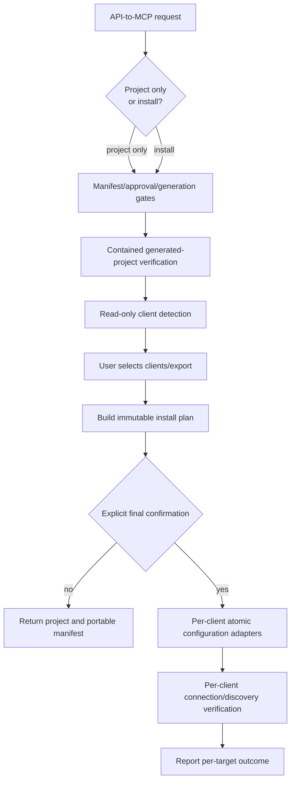

# Agent MCP Installation Design

**Status:** Proposed for implementation review

**Issue:** [#71](https://github.com/Theorvane/type-mcp-api-agent-skill/issues/71)

**Decision:** `api-to-typemcp` remains a local TypeScript stdio MCP-project generator. When explicitly requested, it additionally prepares and installs the generated server into supported agent clients through guarded, per-client adapters.

## Goal

After an agent receives an API-to-MCP request, it must distinguish between:

1. **Generate project only** — create and verify the standalone MCP project; or
2. **Generate and install for an agent** — create and verify the project, detect supported agent clients, let the user select clients, then install the server configuration only after a final confirmation.

The installed server must be immediately usable as tools by the selected agent client after that client reloads its MCP configuration. The generated server remains stdio-first and keeps all existing runtime policy protections.

## Non-goals

- Automatically changing an agent's configuration merely because an MCP project was generated.
- Discovering or copying API credentials, `.env` values, tokens, or existing client secrets.
- Silently enabling protected-write operations.
- Supporting arbitrary undocumented client configuration formats.
- Starting a persistent server daemon; each client owns the stdio subprocess lifecycle.
- Adding streamable HTTP transport in this feature.
- Claiming successful installation for a client whose configuration or tool discovery could not be verified.

## User interaction

### Generation intent gate

Before generating an MCP project, the skill asks one focused question:

> Create the MCP project only, or create it and install it into an agent client?

The default is **project only**. If the user selects installation, normal manifest, receipt, output-directory, and project-verification gates still run before any client configuration is changed.

### Client selection gate

After the generated project passes contained verification, the engine performs read-only client detection and presents only supported detected candidates plus a portable export option:

```text
Detected MCP clients:
- Hermes
- Claude Code
- Codex CLI
- Cursor
- VS Code / GitHub Copilot
- Gemini CLI
- OpenCode
- Portable mcpServers manifest (export only)

Select one or more targets, or export configuration only.
```

The user may select a subset, request portable export only, or cancel. An unsupported/unrecognized client is not modified; the skill offers the portable manifest instead.

### Final installation confirmation

Before any mutation, the skill shows a per-target install plan containing:

- selected client and discovered configuration file;
- exact MCP server name and generated project path;
- the command/arguments to launch the server;
- environment-variable *names* passed through, never values;
- whether the file will be created or patched;
- backup file destination; and
- post-install verification command, if that client provides one.

Only an explicit confirmation of this exact plan authorizes installation. Any changed output path, target set, server name, or configuration fingerprint invalidates the plan and requires confirmation again.

## Architecture



### New bundled modules

```text
skills/api-to-typemcp/
├── scripts/
│   ├── agent_clients.py       # client definitions and safe detection
│   ├── install_plan.py        # deterministic, fingerprinted plan construction
│   ├── install_mcp.py         # backup, atomic patch, rollback, verification
│   └── api_to_typemcp.py      # adds staged detect/plan/install commands
├── templates/
│   └── agent-install/
│       └── mcp-servers.json.tmpl  # portable export
└── references/
    └── agent-mcp-installation.md  # supported clients and user-facing constraints
```

The modules are part of the installed skill artifact. They do not become a separate CLI package or registry release.

## Client adapter contract

Every adapter implements the same bounded interface:

| Operation | Requirement |
| --- | --- |
| `detect()` | Read-only. Locate known client executable/configuration candidates and report evidence; do not create files. |
| `render_server()` | Produce a client-native server entry using the generated project's controlled launcher command. |
| `plan()` | State exact target file, JSON/JSONC/TOML structure, create/patch action, backup path, and verification capability. |
| `apply()` | Re-read and fingerprint the target before mutation; reject parse errors, unsupported format, symlink escape, or changed input. Write atomically and preserve file permissions. |
| `verify()` | Run only a documented client list/test command when available, otherwise structurally re-read the installed configuration and report `configuration-written; runtime-reload-required`. |
| `rollback()` | Restore only the backup made by the current installation transaction when a later mutation or verification fails. |

Initial adapters target **Hermes, Claude Code, Codex CLI, Cursor, VS Code/GitHub Copilot, Gemini CLI, and OpenCode**. Each adapter is enabled only after its currently documented configuration format and verification method are pinned in the reference document and covered by fixture-based contract tests.

The portable adapter never writes to a client configuration. It emits `agent-install/mcpServers.json`, a standard `mcpServers` object, and a short README fragment for manual import into other MCP-compatible clients.

## Generated server launch contract

The generated project receives a controlled launcher definition rather than storing secrets in client configuration:

```json
{
  "command": "node",
  "args": ["/absolute/generated-project/dist/index.js"],
  "cwd": "/absolute/generated-project",
  "env": {
    "TYPE_MCP_BASE_URL": "${TYPE_MCP_BASE_URL}",
    "TYPE_MCP_API_KEY": "${TYPE_MCP_API_KEY}",
    "TYPE_MCP_ALLOW_PROTECTED_OPERATIONS": "${TYPE_MCP_ALLOW_PROTECTED_OPERATIONS}"
  }
}
```

The exact placeholder syntax is adapted to each client only when documented as supported. A client configuration must contain references or names, not secret values. Where a client cannot safely represent environment references, the adapter provides a generated launcher that reads `.env` at runtime from the generated project with restrictive file permissions; the client still receives no secret values.

The launcher is emitted only after the generated project has been built. It validates that the entrypoint exists and resolves under the approved output directory.

## Safety and correctness rules

1. **No implicit install.** Generation alone never scans or modifies client configuration.
2. **No credential migration.** Detection never reads `.env` contents or copies credentials from a client config. Installation displays only environment variable names.
3. **User-selected scope.** Only selected targets may be modified. A detected client is not automatically selected.
4. **Path containment.** Generated project paths and client configuration paths are canonicalized; symlink escapes and traversal are rejected.
5. **Atomicity and backups.** Each modified configuration gets a timestamped same-directory backup with restrictive permissions. Writes use a temporary same-directory file plus atomic replacement.
6. **Conflict detection.** Before mutation, the adapter confirms the configuration fingerprint remains the one presented to the user. It refuses duplicate server names unless the user separately chooses a replace action in a new plan.
7. **Least privilege.** The MCP server inherits only the minimal required launch environment. Existing protected-write policy remains fail-closed unless `TYPE_MCP_ALLOW_PROTECTED_OPERATIONS` is explicitly set at runtime.
8. **Bounded verification.** Verification never calls the user API. It validates configuration/tool discovery only; generated-project smoke tests retain the local fixture upstream.
9. **Partial failure truthfulness.** A failure for one target rolls back that target. Previously verified target installations remain reported separately; the final result lists each outcome without claiming universal success.
10. **No unsupported format guessing.** Unparseable/unknown formats are left untouched and returned as a manual portable-export path.

## Configuration format strategy

The installer uses a typed internal model:

```text
McpServerSpec
  name: string
  command: string
  args: list[string]
  cwd: absolute contained path
  envReferences: map[string, reference]

InstallPlan
  target: client identifier
  configPath: absolute path
  action: create | add | replace
  configFingerprint: sha256
  backupPath: absolute path
  verification: supported | structural-only
```

Client adapters translate `McpServerSpec` to their native format. JSONC and TOML parsing/writing must preserve unrelated user-owned entries; if safe preservation cannot be guaranteed, the adapter stops before modification and exports a portable manifest instead.

## Error handling

| Condition | Outcome |
| --- | --- |
| No supported client detected | Return verified project plus portable manifest; no install mutation. |
| User selects no client | Same as project-only result. |
| Existing config parse error | Do not modify it; explain the path and offer portable export. |
| Existing duplicate server name | Do not overwrite; present a distinct replace/rename plan. |
| Plan input changes before confirmation/apply | Invalidate plan and rebuild it. |
| Write or verification failure | Restore that target's backup, report the rollback result, continue reporting independent targets. |
| Client needs restart/reload | Report exact documented reload action; do not claim runtime discovery before it occurs. |

## Acceptance criteria

- The skill asks whether the request is project-only or project-plus-install before client configuration activity.
- Project-only requests never inspect or modify agent configuration.
- Install requests detect the supported clients without reading secrets and allow multi-select or portable export.
- The user sees and confirms an exact per-target configuration plan before any mutation.
- Hermes, Claude Code, Codex CLI, Cursor, VS Code/GitHub Copilot, Gemini CLI, and OpenCode adapters are fixture-tested against documented formats or intentionally unavailable with a portable export.
- Client configurations receive no secret values.
- All writes are atomic, backed up, path-contained, and conflict/fingerprint checked.
- A generated launcher or client-native configuration starts the built stdio server from the generated project.
- Per-target verification reports tool/configuration discovery accurately and makes no live upstream API call.
- Existing protected-write authorization stays fail-closed.

## Delivery sequence

1. Verify current client configuration formats and documented CLI test/reload mechanisms; add pinned reference evidence for each adapter.
2. Add model, detection, plan, and portable-export contracts with read-only fixture tests.
3. Add one adapter at a time using test-first atomic patch and rollback behavior.
4. Add generated launch metadata/launcher and contained verification of the server command.
5. Add interactive skill instructions, reference guide, E2E multi-target fixtures, and release-artifact contract coverage.
6. Perform independent exact-head review and release only after every enabled adapter has verification evidence.
