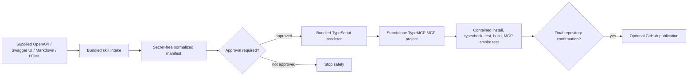

# Embedded TypeMCP Generator Design

**Status:** Proposed for implementation review
**Issue:** [#48](https://github.com/Theorvane/type-mcp-api-agent-skill/issues/48)
**Decision:** `api-to-typemcp` ships its own deterministic generator. It does not depend on a separate `type-mcp-api-cli` repository, package, or npm release.

## Goal

Make an installed `api-to-typemcp` skill able to turn supplied API documentation into a runnable, standalone TypeScript MCP project built with the published [`@theorvane/type-mcp`](https://www.npmjs.com/package/@theorvane/type-mcp) package.

The generated project must use TypeMCP's published decorator and runtime surfaces, including `@McpServer`, `@McpTool`, `createMcpServer()`, and `startStdioServer()`. It must never copy TypeMCP source code into generated output.

## Non-goals

- Creating, restoring, or publishing a separate `type-mcp-api-cli` package or repository.
- Copying the `@theorvane/type-mcp` implementation into generated projects.
- Unbounded endpoint discovery from a bare base URL.
- Persisting credentials, OAuth/OIDC login flows, or automatic public repository publication.
- Treating guessed operations from prose as executable without an explicit manifest approval.

## Architecture



### Bundled skill layout

```text
skills/api-to-typemcp/
├── SKILL.md
├── scripts/
│   ├── api_to_typemcp.py       # staged command entry point
│   ├── intake.py               # bounded local/remote source acquisition
│   ├── structured_specs.py     # OpenAPI 3.x and Swagger 2.0 normalization
│   ├── swagger_ui.py           # supplied Swagger UI configuration discovery
│   ├── documents.py            # supplied Markdown/HTML candidate extraction
│   ├── manifest.py             # normalized manifest, digest, approvals
│   ├── policy.py               # operation execution-policy classification
│   ├── render.py               # TypeScript project renderer
│   └── verify_generated.py     # static generated-project checks
├── templates/
│   └── typescript-stdio/       # controlled TypeMCP project templates
└── references/
    └── type-mcp-runtime.md     # supported published TypeMCP surface
```

The Python engine is an implementation detail shipped with the skill, not a separately published CLI. Its entry point exposes deterministic staged commands to the agent: `inspect`, `manifest`, `approve`, `generate`, and `verify`.

## Input handling

| Source | Intake boundary | Generation eligibility |
| --- | --- | --- |
| OpenAPI 3.x / Swagger 2.0 JSON or YAML | Parse a supplied local file or explicit source URL as untrusted data; reject malformed or unsupported structures. | A schema-valid manifest is shown for review before generation. |
| Swagger UI | Inspect only the supplied page, its configuration, and explicit referenced specification URLs. No site-wide crawling. | Resolve to a structured specification, then follow the structured-spec flow. |
| Markdown / HTML documentation | Extract evidence-backed candidate operations only from supplied documents. | Explicit user confirmation of the exact manifest digest is mandatory. |

A bare API origin or base URL is insufficient to enumerate endpoints.

## Manifest and approval

The engine creates a versioned, secret-free manifest containing:

- source kind and sanitized provenance;
- digest of normalized source/operation content;
- every candidate operation, method, normalized path, parameters, request body, response summary, and evidence;
- inferred environment-variable names and authentication mapping names, never values;
- confidence and warnings for document-derived operations;
- operation policy and a canonical manifest digest.

All document-derived manifests require explicit user approval of the current canonical digest. Any manifest modification invalidates prior approval. Structured specs are also presented before generation so users can remove operations, rename tools, or revise mapping names.

## Generated TypeMCP project

The renderer creates an empty-target project with a normal npm dependency on a reviewed `@theorvane/type-mcp` version and `zod`. The default transport is stdio.

```text
<output>/
├── package.json
├── tsconfig.json
├── .env.example
├── README.md
├── api-to-typemcp.manifest.json
├── src/
│   ├── index.ts               # creates and starts the TypeMCP stdio server
│   ├── server.ts              # @McpServer declaration and @McpTool methods
│   ├── api-client.ts          # URL, auth, request, response-safe handling
│   ├── policy.ts              # exact operation-ID authorization gate
│   ├── schemas.ts             # generated Zod input schemas
│   └── operations.ts          # normalized operation descriptors
└── test/
    ├── policy.test.ts
    └── server.test.ts
```

For each approved operation, the renderer emits one `@McpTool` with a stable, collision-free tool name and a generated Zod object schema. `server.ts` imports only published TypeMCP APIs; `index.ts` compiles the declaration with `createMcpServer()` and starts it with `startStdioServer()`.

Streamable HTTP is intentionally deferred as an explicit future transport option. The first implementation must produce a reliable stdio server.

## Execution policy and authentication

| HTTP method | Default policy | Runtime behavior |
| --- | --- | --- |
| `GET`, `HEAD`, `OPTIONS` | `read` | May build and send an upstream request. |
| `POST`, `PUT`, `PATCH`, `DELETE` | `protected-write` | Requires an exact operation ID in `TYPE_MCP_ALLOW_PROTECTED_OPERATIONS`. |
| Unknown method | `deny` | Fails before request URL, query, headers, body, or auth are constructed. |

`TYPE_MCP_ALLOW_PROTECTED_OPERATIONS` rejects wildcards, unknown IDs, malformed values, and implicit grants. Authentication configuration is represented only as environment-variable references in `.env.example`, never as values in manifests, generated source, logs, test fixtures, git history, or issue content.

Generated tools report safe client-facing errors and must not expose stacks, credentials, raw private URLs, or raw upstream response bodies.

## Verification and side effects

Generation is a local side effect only after an approved manifest and confirmation that the output directory is empty or explicitly approved for replacement.

Generated-project verification runs in a fresh temporary copy with a scrubbed environment:

1. inspect `package.json` and generated manifest for published `@theorvane/type-mcp` dependency and secret hygiene;
2. install using the controlled package-manager flow;
3. run lint, typecheck, test, and build;
4. execute an offline MCP stdio smoke test through the official MCP SDK with a local fixture upstream;
5. prove a denied protected-write operation made no upstream request.

A live authenticated API call and GitHub publication each require separate, immediately preceding user confirmation. Publication requires the confirmed owner/org, repository name, visibility, and exact source branch.

## Migration from the old CLI boundary

The external-CLI compatibility gate is removed. Product, architecture, API, release, validation, and skill documentation will state that the versioned skill release is the generator delivery unit.

The existing `packages/type-mcp-api-cli/` bootstrap prototype is removed as part of this migration. Its source, package metadata, package-specific documentation, tests, schemas, and workflows are not retained as a parallel generator or a runtime dependency. No generated workflow may require its npm publication.

## Acceptance criteria

- An installed skill includes all executable scripts/templates required for generation.
- No generation path resolves, installs, or invokes `type-mcp-api-cli`.
- A valid supplied OpenAPI 3.x or Swagger 2.0 fixture produces a standalone stdio MCP project using `@theorvane/type-mcp`.
- Every approved endpoint becomes an MCP tool with generated input validation.
- Protected-write and deny policy are enforced before request construction.
- Swagger UI and supplied Markdown/HTML sources use bounded intake; document-derived manifests require exact-digest approval.
- Generated output passes contained install, typecheck, test, build, and offline MCP smoke verification.
- No secret values appear in outputs or release artifacts.

## Delivery sequence

1. Replace the product and architecture boundary and update the skill distribution contract.
2. Add a test-first bundled engine for structured specs and manifest rendering.
3. Add TypeMCP stdio template rendering and generated-project verification.
4. Add Swagger UI and document intake behind the manifest approval contract.
5. Add optional HTTP transport only in a separately designed increment.
