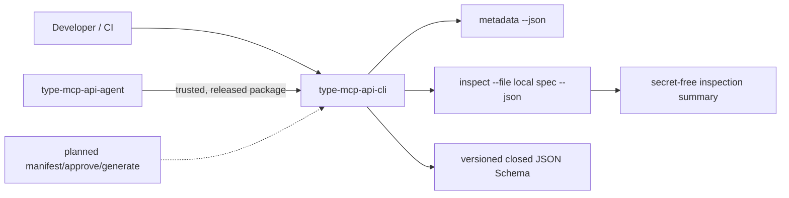

# Architecture overview

**Status:** Metadata/schema publication and local structured-spec inspection are implemented.

## Current implementation

- `src/metadata.ts` defines protocol and manifest-version metadata.
- `src/cli.ts` exposes `metadata --json` and `inspect --file <path> --json`.
- `src/inspect.ts` only reads local `.json`/`.yaml`/`.yml` structured specifications, classifies OpenAPI 3.x or Swagger 2.0, and returns a safe summary without raw path/body output.
- `schemas/api-manifest-1.schema.json` publishes the closed v1 manifest artifact.

## Planned stages

The future `manifest`, `approve`, and `generate` stages must remain deterministic and secret-free. They may be added only after contract tests demonstrate their side-effect boundaries and after the agent compatibility policy is updated through its own reviewed change.

The generator will emit a separate MCP project that has `type-mcp` as an npm dependency; it must never copy `type-mcp` source into output.
